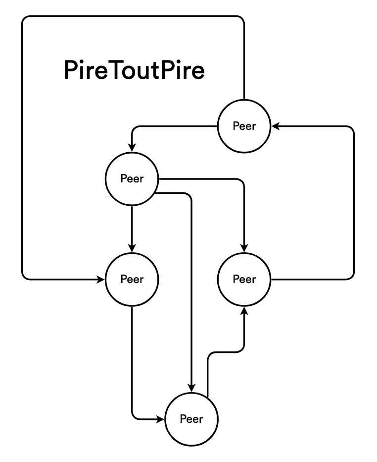
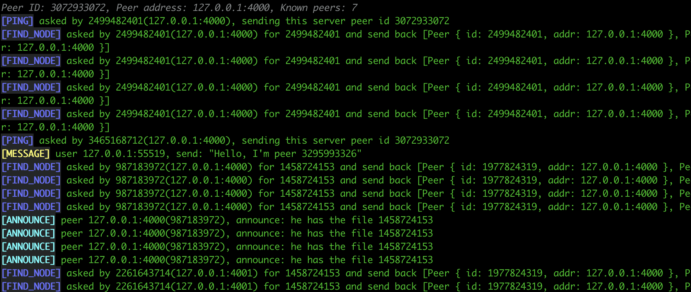

# PireToutPire


<p align="center">
    
</p>

This project implements a simplified p2p network. It allows to send message from
a peer to another in a decentralized manner. File sharing (like bittorrent) is
also handled.

If user A sends a message M to user B and B is known by the service, the service
will deliver M to user B. All messages sent by users will be transferred
directly from one user to the other across the network, in peer-to-peer, and
doesn't rely on a central server.

Implementation use the Kademlia DHT algorithm, and handle these 4 concepts:
  * ping: check if a peer is alive
  * find_node: find for the "closest" nodes, given a target
  * store_value: store a value into the dht
  * find_value: get a value store into the dht

On top of that, some concept have been taken from bittorent, such as:
  * announce: tell which peers are able to share a file, even partially
  * get_peers: retrieve all the peers who share a given file

Then:
  * send_message: simply send a message to a user by its ID.

# Documentation and explanation

There's a bunch of documentation available here: [doc section](doc/README.md).

Mainly, you'll find explanation about the concept, implementation choices,
limitations and security flaws.

# Running and playing with it

The simplest way you can launch a server is by doing that:
```sh
cargo run -- --server-addr="127.0.0.1:4001" --peer-id=1 seed
```

<p align="center">
    
</p>

This seed server will be joinable, via a bootstrap  by another peer:
```sh
# Join the seeder above:
cargo run -- --server-addr="127.0.0.1:4002" --peer-id=2 bootstrap 127.0.0.1:4001
# Pass in seed mode:
cargo run -- --server-addr="127.0.0.1:4002" --peer-id=2 seed
# Join the seeder above:
cargo run -- --server-addr="127.0.0.1:4003" --peer-id=3 bootstrap 127.0.0.1:4002
# List which peers we currently know:
cargo run -- --server-addr="127.0.0.1:4003" --peer-id=3 list
# Let's send a message to peer 1 (we only know through 2)!
cargo run -- --server-addr="127.0.0.1:4003" --peer-id=3 message 1 "Hello"

```

Then, there is a CLI (using clap and colored) which can be called like that:
```sh
cargo run -- help
```
The help will show all the possibilities, as you can see here: [Help](doc/Help.md).

It's also possible to generate the binary using:
```sh
make build
./demo/pire2pire --help
```

# Demo

A demo is provided to show all available features. This demo is a script which
will simulate many situations, to show all handled features. Basically just run
it, watch the presentation and press enter to pass to the next simulation.

```sh
make demo
```

A small glimpse of what it will looks like:
```
  _____  ______ __  __  ____
 |  __ \|  ____|  \/  |/ __ \
 | |  | | |__  | \  / | |  | |
 | |  | |  __| | |\/| | |  | |
 | |__| | |____| |  | | |__| |
 |_____/|______|_|  |_|\____/

CTRL + C will skip the current test, not the entire demo
Press CTRL + C twice to abort the demo
Press enter to start the demo
```

# Tests

Everything is unit tested. You can launch all the tests that with:
```sh
cargo test
```

# Linting

You'll find some custom linters made with dylint. There are some very specific
rules we were enforcing in my previous company. These are examples of what can
be done.

Launch clippy:
```sh
cargo clippy
```

Launch personal linter:
```sh
# You might need to install dylint
cargo install cargo-dylint dylint-link

# Launch it!
cargo dylint --all -- --all-features --bins --examples --tests
```

## VsCode integration

It's possible to change the default cargo command in VsCode to automatically
launch clippy and dylint. Very handy to view at glance any warnings.

In settings.json, just override the default command like that:
```json
    "rust-analyzer.checkOnSave.overrideCommand": [
        "cargo",
        "dylint",
        "--all",
        "--workspace",
        "--",
        "--all-targets",
        "--message-format=json"
    ]
```
