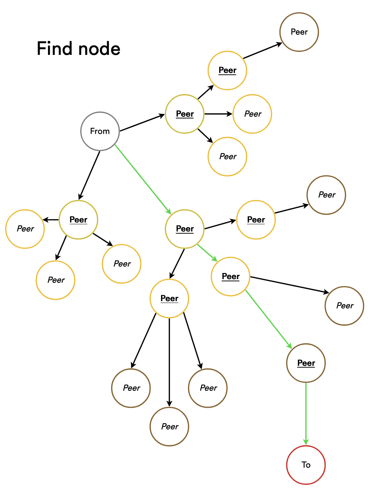

# Implementation

## What is handled

It's possible to send a message from a peer to another one, without relying on a
server. It handles storing and getting a value in a DHT. Finally, it's also
possible to share files by chunk.

## Routing table

The routing table is mostly a tree, which associates a peer id to a list of
peers. In this system, as the key is a uint32, 4 billions peer id are allowed.
We're keeping 4 peers for each peer id. It means, we would need to store 16
billions peers. On a big network, it's not very scalable.

To solve that, we're using an unbalanced tree. Meaning, we're storing more close
nodes, than far away nodes. To achieve that, let's imagine a tree, where you
only store 4 values on the right, and another tree on the left.

Every time we fill a bucket (more than 4 values) on the left side, we just split
it into two leaves. The range is then split in the middle, and all values copies
to the associated side.

For example:
```
           (16)
           / \
        (8)   [16, 25, 30, 31]
        / \
     (4)   [8, 9]
     / \
[0, 1] [4, 5, 6]
```

As we're using an id which is a uint32, we will maintain only 32 buckets of 4
peers, meaning we're keeping only 128 peers to maintain.

Internally, what we're storing are not the peer id, but the distance between the
peer and ourself. The routing table is masking that implementation detail, and
only seems to handle peer id.

It's currently implemented as a tree, but it could have been made with a single
array of 128 items.

Also, all peers which is not responding is marked as "questionnable", then as
"bad" if it's still not answering. Adding new peer into a full bucket, can only
be done if there's "bad" peers to replace. This means that peers that have
stayed longer in the network have the priority. This is done on purpose, as the
authors of the Kademlia found that computers that have been around the longest
in the network are much more likely to continue staying on than new peers. Thus,
old peers are favored to maximize connectivity in the network from experimental
observations of how peer-to-peer network participants behave.

## Distributed hash table (DHT)

The choice has been made to implement the Kademlia DHT describe in this paper:
[maymounkov-kademlia-lncs.pdf](https://www.google.com/url?sa=t&rct=j&q=&esrc=s&source=web&cd=&cad=rja&uact=8&ved=2ahUKEwiSwtL91bD7AhUjgP0HHT9RCCUQFnoECAoQAQ&url=https%3A%2F%2Fpdos.csail.mit.edu%2F~petar%2Fpapers%2Fmaymounkov-kademlia-lncs.pdf&usg=AOvVaw01RgwZJCaDpIIyPzkik8oN)

It allows to find node in a sustainable way for big network, and only need
little tweaks for small networks.

### Find node

To find a peer, we take the closest node we know in our routing table. Starting
from that, we ask this peer to give us the 4 closest known peers which are close
to the target peer id.

Then, we're asking, in parallel, each of these nodes to give us their 4 closest
peers. We regroup these 12 peers, sort them by distance, and only keep 4 of
them. We're repeating this process, until we found our nound, or if the next
rounge of peers is not closer to target peer id.

<p align="center">
    
</p>

Everytime, we're contacting a peer, this peer saves us in his routing table. It
allows the peers network to be refreshed automatically.

### Join

The first time we join a new network, we don't know any peer id yet. So, we need
to `bootstrap` our client. To do so, we just ask a known peer address, to find
ourself in the network. This remote peer will add us into his routing table, and
return us its 4 closest peers. We're now knowing 4 peers, and 1 one them knows
us.

To accelerate this process, it's possible to force the initial join to perform a
more deep search, to discover more peers.

### Store value

Storing a value is close to finding a node. The way to achieve that, is to put a
value to the 4 closest nodes of the message key. To keep things simple, I simply
find the 4 closest nodes using the `find node` rpc, and then store ask these 4
peers to store the key/value.

### Find value

Finding a value is pretty straighforward. As we spread the value to the closest
peers, it simply required to performa a `find_node` to get the 4 closest peers,
and ask any of them to give us the value.

### Ping

This simple call is just there to check if peer is alive. Peer will respond with
their peer id, which prove handy when joining the network for the first time.

## Message

A message can be send from peer `A`to peer `B`. To do that, we're performing a
`find node` to find the remote peer, and then send him a message, using is
socket address.

## File sharing

File sharing is handled as chunks download. It's possible to scan a directory
for file, and share them. Peers can download them by their crc.

File table of who own what is maintained directly in our DHT.

### File info

Given a crc, we retrieve the file metadata:
  * filename
  * size
  * crc
  * chunk size
  * number of chunks

### Chunk download

Ask a peer to send us a chunk. Usually, this call is made to many peers at once,
in parallel. It allows us to download a file by chunks, from many peers. Even if
we don't have all chunks of a file, we're able to send completed chunks to other
peers.

Note that the chunk size is a fixed hard coded value which must be the same for
all peers, to work properly.

### Downloading strategy

Downloading chunks is made with a queue, where we assigned alived peers to send
us chunks. The peer  "take" task as they finished to send us a chunk. It's
favoring the fastest peer (the first to finish, is the first to take a task).

Other strategy exists. A better one would be to download rarest chunks first, to
avoid situation where the only seeder leaves, letting leechers with a partial
file.

For a company which wants to favor bandwith and speed, a good strategy would be
to download pieces not sent by a cdn but by other users, and fast enough. So a
mixed between speed and provider. Here, rarest pieces is not relevant, as the
master tracker should always be there.

### Announcement

It's the same thing as the `store value` rpc, but for files. We're sending to
the 4 closest peers, the fact we're sharing a file, and let them associated the
file id to our address.

### Get peers

It's the same thing as the `find value` rpc, but for files. We're asking
the 4 closest peers, for a file by its id.

# Tweaks

## Hop tweaks

Some enhancements has been made to bypass some limitations. The Kademlia DHT
implementation is great for big network, but for (very) small ones, it's not
working well.

Take for exemple these peers (a dash mean they know each others):
```
1 -- 2
| \ /
5  3 - 4 - 7
    \      |
9    6     8
```

Let's say we want to search 8, starting from 1. 8 is there, and there is a path
to it. Although, very few nodes knows about it, and finding nodes is quickly
interrupted because the distance is too far away.

If we draw distance from 8, it would look like this:
```
9 --- 10
| \  /
13 11 - [12] - 15
    \        |
1   14       0
```
We can see that it will block at node 12 because it's not closer than the
previous best (which was 10).

Scarcity could be an issue. To bypass that, I implemented a `max-hop` option
which is using a spreading strategy, which is more effective on small, not
quickly refreshed network. It's especially useful for a initiating a bootstrap.

## Too far peers

One of the reason some peers could not knows other peers in a small network, is
due to the routing table only keeping few far away peers. If we have a lot of
peers, which happen to be far away to each other, we're only keeping 4 of them,
forgetting a part of the network.

Example:
```
     ..................................
    /                                 |
A - B ---------------------- W     X, Y, Z are too far and not kept by B
|   |  \---------------- S
|   |   \----------- O
|   |    \------ K
C - D

X, Y, Z are "seeing" B, but B don't see them
```

To mitigate that, I added a LRU-like cache of all recents "too far way" peers,
of 100 entries, on top of the routing table (which can be disabled). It means
we're consistently keeping the knowledge of the freshest, furthest nodes. As a
peer should be asked only for its closest nodes, this cache shouldn't be hit
often in a big network. 100 entries is small, so there is no impact on a big
network. But for a small network, it allows peers far from each others to be
seen.

# Protocol

All rpc are hand crafted. As this project is kinda there to show how to make its
own p2p network, let's not rely on grpc and protobuf (it is also one less
dependency to care about).
